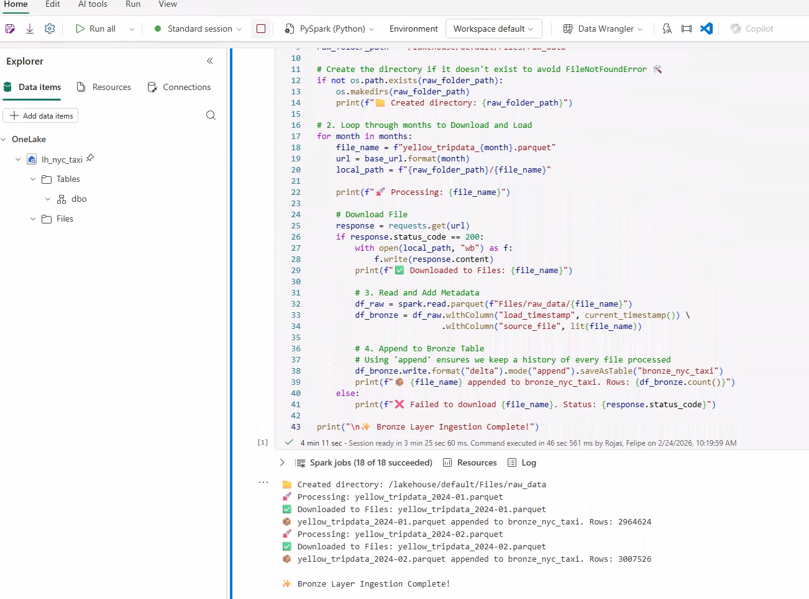
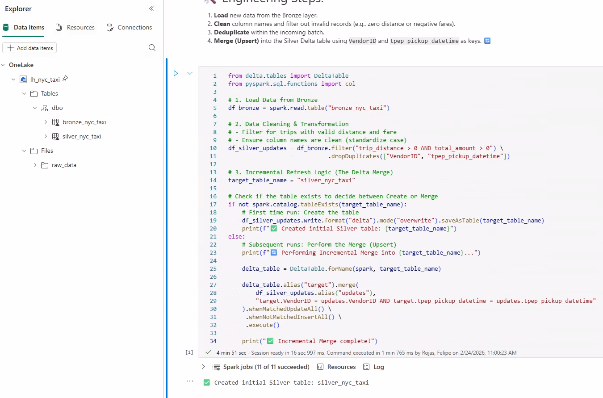
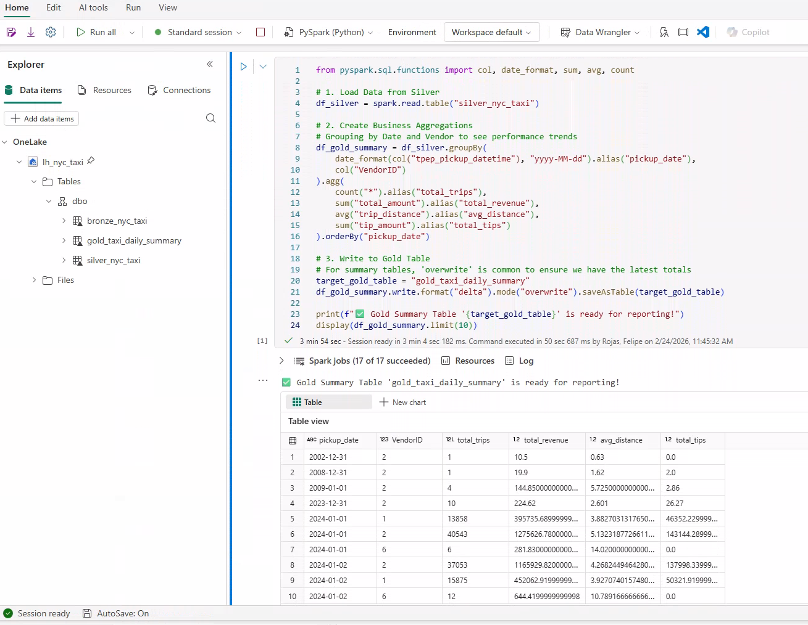

# 🗽 NYC Taxi Medallion Architecture with PySpark & MS Fabric

This project demonstrates a production-grade **Medallion Architecture** (Bronze, Silver, Gold) implemented entirely within **Microsoft Fabric** using **PySpark** notebooks. It features an **incremental refresh** logic using Delta Lake's `MERGE` capability to handle large-scale data ingestion and transformation.

---

## 🧠 Problem Statement

Efficiently processing millions of rows of raw trip data requires a scalable architecture that ensures data quality and idempotency. This project solves the challenge of moving raw data into a structured Lakehouse environment while maintaining a clean "Source of Truth" through incremental updates rather than full overwrites.

---

## 🛠️ Tech Stack

- **Microsoft Fabric**: Unified platform for Lakehouse and Spark runtimes
- **PySpark**: Distributed data processing for Bronze, Silver, and Gold layers
- **Delta Lake**: ACID transactions and Incremental `MERGE` (Upsert) logic
- **Python**: API-based data ingestion and folder management
- **Git & GitHub**: Version control and project documentation

---

## 📁 Project Structure

```
nyc-taxi-medallion-fabric/
├── notebooks/        # PySpark notebooks for each Medallion stage
│   ├── 01_Ingestion_Bronze.ipynb
│   ├── 02_Transformation_Silver.ipynb
│   └── 03_Aggregation_Gold.ipynb
├── images/           # Snapshots of the architecture and data results
├── data/             # Reference to the NYC TLC Public Data source
└── README.md         # Project overview
```

---

## 🏗️ Architecture & Snapshots


### 🥉 Bronze Layer: Ingestion
Raw parquet data is pulled from the NYC TLC repository, landed in the Lakehouse 'Files' section, and appended to a Delta table with ingestion metadata.
📸 **Snapshot**:  


### 🥈 Silver Layer: Transformation & Merge
Data cleaning and schema enforcement. Implements a **Delta Merge (Upsert)** logic based on `VendorID` and `tpep_pickup_datetime` to prevent duplicates.
📸 **Snapshot**:  


### 🥇 Gold Layer: Business Aggregation
Final business-ready summary table grouping performance by date and vendor, calculating total revenue, trip counts, and average distances.
📸 **Snapshot**:  


---

## 🚀 Key Insights & Features

- **Incremental Refresh**: Using the `DeltaTable` API ensures that only new or updated records are processed, significantly reducing compute costs.
- **Data Quality**: Applied filters to remove outliers, such as trips with zero distance or negative fare amounts.
- **Modular Engineering**: Each layer is decoupled into specialized notebooks for better maintenance and orchestration.

---

## 🏅 Author & Certifications

**Felipe Castro** Data Analytics Engineer @ EPAM Systems

- 🏅 **[DP-700: Microsoft Certified: Fabric Data Engineer Associate](https://learn.microsoft.com/api/credentials/share/en-us/FelipeCastro-8026/96572499DF943EBC?sharingId=13D660F56C1DFFA3)**
- 🏅 **[DP-600: Microsoft Certified: Fabric Analytics Engineer Associate](https://learn.microsoft.com/api/credentials/share/en-us/FelipeCastro-8026/6C5A2F5A8A5864FC?sharingId=13D660F56C1DFFA3)**
- 🏅 **[PL-300: Microsoft Certified: Power BI Data Analyst Associate](https://learn.microsoft.com/api/credentials/share/en-us/FelipeCastro-8026/F853AABE365874B3?sharingId=13D660F56C1DFFA3)**

---

## 🧰 Tools & Libraries


